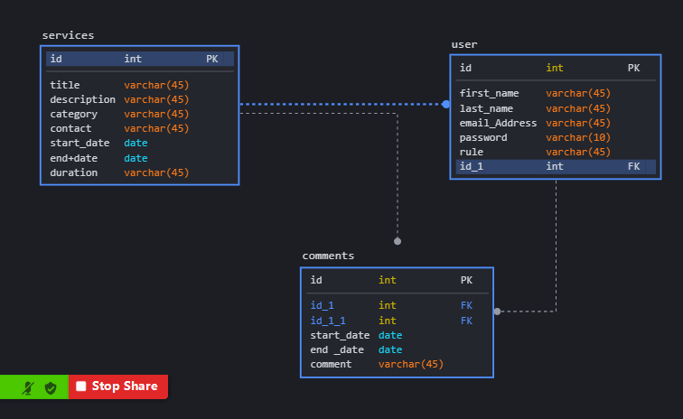

# volunteer

Our App allow the user to register and add Ad for volunteer service with all requirements and information .

#
<h1>Technical Used:</h1>
<ul>
<li>CSS</li>
<li>HTML</li>
<li>Java Script</li>
<li>Java</li>
<li>Github</li>
<li>Git Bash</li>
<li>Spring boot</li>
<li>Maven</li>
<li>Amazon Web Services</li>
<li>React<li>
</ul>

#
<h1>Wireframe:</h1>

#
<h1>User Story:</h1>
<li>As a user i want to Register.</li>
<li>As a user i want to log in.</li>
<li>As a user i want to add service.</li> 
<li>As a user i want to edit service.</li> 
<li>As a user i want to delete service.</li>
<li>As a user i want to add comment.</li>
<li>As a user i want to log out.</li> 

#
<h1>ER : </h1>

#
<h1>Challenges: </h1>
<li>React.</li>
<li>Conflict in files.</li>
<li>Manage time.</li>
<li>Route.</li>

#
<h1>Future plan:</h1>
<li>Change Password in react.</li>
<li>Complete edite Profile.</li>
<li>Add comment in React.</li>
